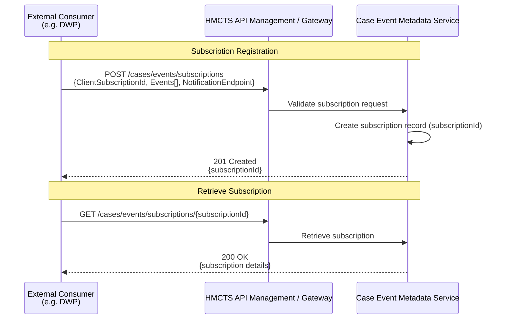
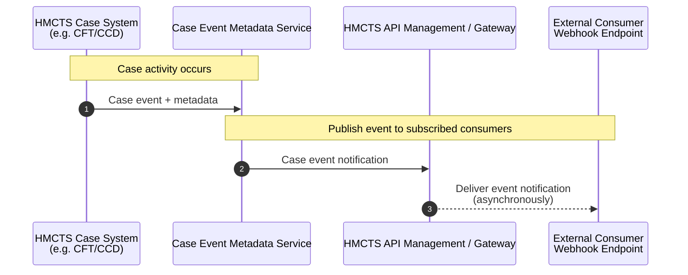

# SSCS Tribunal Case Subscription History Metadata API - Proposal

## Introduction

This proposal outlines a high‑level integration concept for enabling external justice partners — starting with DWP as the 
initial consumer — to receive structured, high‑signal notifications about meaningful case activity within the Social Security and Child Support (SSCS) product. 
While DWP is the first organisation engaging with this capability, the intention is to define a reusable integration pattern 
that enables any authorised partner — including other government departments, law enforcement bodies, legal representatives, 
and future justice-sector services — to benefit from timely, structured visibility of case activity.

The purpose is to provide a shared understanding of the problem, the emerging solution direction, and the next steps required to validate and progress this work.

## Problem Summary

### DWP Operational Challenges
DWP currently relies on email notifications and manual checks within Manage Cases, which leads to missed updates, inefficient workflows, and difficulty prioritising cases. 
These issues are especially acute for:
- Further evidence uploaded close to hearing dates.
- Direction notices requiring timely action.
- Last‑minute document uploads.
- Newly booked hearings needing Presenting Officer allocation.

Although these challenges are described from a DWP perspective, they highlight a broader class of problems that any 
external partner may face when timely awareness of case activity is required.

### Technical Challenges
Across HMCTS, integrations remain fragmented and inconsistent. Current patterns rely heavily on email, lack filtering, 
and provide no standardised way of exposing real‑time case activity. This creates operational risk, noise, and integration complexity.

These limitations affect all potential consumers, not just DWP, and underline the need for a scalable, reusable event‑notification pattern at the boundary of HMCTS estate.

### Strategic Alignment

| Objective | Alignment |
|----------|-----------|
| API‑First | Contract‑first event metadata API. |
| Integration Platform | Delivered via unified APIM. |
| Marketplace Enablement | Pattern becomes reusable across domains. |
| Reducing Legacy Channels | Moves partners away from email notifications. |
| Multi‑Partner Data Sharing | Supports DWP and future OGDs. |

## Proposed Option: Event History Metadata Subscription API

### Overview
A subscription‑based API allowing any authorised external consumer to:
1. Subscribe to selected event types (e.g., document uploaded, hearing scheduled, direction issued) - **NOTE** event types TBC.
2. Provide a webhook endpoint for receiving notifications.
3. Receive lightweight event metadata:
   - event type  
   - timestamp  
   - case identifier  
   - minimal contextual indicators  

Whether any follow‑up retrieval API is required will depend on each consumer’s behaviour and operational needs; for the 
initial DWP use case, the event metadata alone may provide sufficient information without requiring additional API calls.

### Why Subscription Instead of Batch Polling?
- The consumer needs timely updates, not historical bulk data.
- Reduces the risk of missed or lost notifications caused by manual inbox‑driven processes.
- Avoids tight coupling by letting HMCTS publish events without requiring consumers to poll or create synchronous integrations.

## High-Level Architecture

1. DWP registers a subscription with event filters and a webhook URL.  
2. HMCTS detects relevant events from CFT/CCD event history.  
3. HMCTS sends metadata notifications to DWP.  
4. DWP may optionally call a pull API for additional data.

This minimises roadmap impact on core CFT systems and fits the federated enablement model.

## High‑Level Sequence Diagram

### Subscription Registration & Retrieval Flow

### Event Publication & Notification Flow

## Considerations
- Under‑ or over‑notification.
- Metadata too minimal without follow‑up API.
